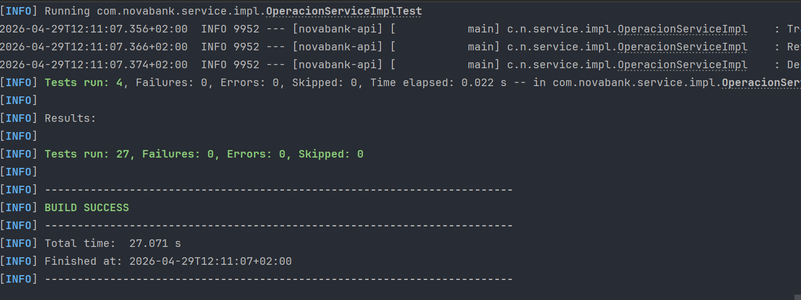

# NovaBank Spring Boot


# Índice

- [Introducción](#introducción)
- [Tecnologías Utilizadas](#tecnologías-utilizadas)
- [Requisitos del sistema](#requisitos-del-sistema)
- [Arquitectura y Principios](#arquitectura-y-principios)
- [Configuración Base de Datos](#configuración-base-de-datos)
- [Ejecución de la Aplicación](#ejecución-de-la-aplicación)
- [Documentación y seguridad](#documentación-y-seguridad)
    - [Obtención del Token JWT](#obtención-del-token-jwt)
- [Testing](#testing)
- [Arquitectura basada en principios solid](#arquitectura-basada-en-principios-solid)
- [Información Importante](#información-importante)
    - [Autor](#autor)
    - [Aviso legal y Licencia de uso](#aviso-legal-y-licencia-de-uso)
---
# Introducción
NovaBank es una API REST desarrollada con Spring Boot para la gestión de un sistema
bancario básico. Permite la administración de clientes, cuentas bancarias y la realización 
de operaciones financieras (depósitos, retiros y transferencias), se garantiza la consistencia
de los datos y la seguridad de los mismos a través de autentificación JWT.
---

# Tecnologías Utilizadas
* **Java 17**
* **Spring Boot 3**: Se ha usado Web, Data JPA, Security y validation.
* **Spring Security & JWT**: Autentificación y Autorización.
* **PostgreSQL**: Base de datos principal.
* **H2 Database**: Utilizada para el Testing como memoria.
* **JUnit 5 & Mockito**: Testing Unitario y de Integración.
* **Swagger / OpenAPI**: Documentación de la API.
*  **Lombok**: Reducción de código boilerplate.
* **Maven 3.6+**: Gestión de dependencias.


# Requisitos del sistema

Para ejecutar el proyecto localmente se requiere:

- **Java 17 o superior**
- **Maven 3.6 o superior**
- **PostgreSQL 14 o superior**
- **Postman** (opcional, para probar la API)

---

# Arquitectura y Principios
El proyecto sigue una arquitectura multicapa y respeta los principios **Solid**, 
lo que garantiza un código limpio, escalable y mantenible. Se ha implementado **DTO** para
aislar el modelo de la base de datos de los datos expuestos en los endpoints.

├── controller: Puntos de entrada a la API.   
├── repository: Acceso a datos (Spring Data JPA)  
├── model: Entidades de base de datos  
├── config  
├── dto: Objetos de transferencia de datos.  
├── exception  
├── mapper  
├── security  
└── service: Lógica de negocio e interfaz.  

Además, al incluir el controlador de excepciones global, `GlobalExceptionHandler` sirve para estandarizar las respuestas de error, `401`, `403`,`404`, etc.

---

# Configuración Base de Datos

Antes de iniciar la aplicación necesitamos crear la base de datos, en la consola de PostgreSQL escribimos lo siguiente:
```bash
CREATE DATABASE novabank;
```
Después, hay que configurar el archivo `src/main/resources/application.yml`, con las credenciales del entorno.

<details><summary>Desplegar información de application.yml </summary>

```bash
spring:
  application:
    name: novabank-api #Poner aqui el nombre de vuestra aplicación creada.

  datasource:
    url: jdbc:postgresql://localhost:5432/novabank
    username: postgres #El usuario que hayas
    password: tu_contraseña_aqui  # Asegúrate de que coincida con tu Postgres local
    driver-class-name: org.postgresql.Driver

  jpa:
    database-platform: org.hibernate.dialect.PostgreSQLDialect
    hibernate:
      ddl-auto: update
    show-sql: true
    properties:
      hibernate:
        format_sql: true

  # Esto ayuda a que el GlobalExceptionHandler pueda capturar mejor los mensajes

  mvc:
    throw-exception-if-no-handler-found: true
  web:
    resources:
      add-mappings: true
server:
  port: 8081 # Asegurate de que este es tu puerto, de normal puede ser 8080

  error:
    include-message: always # Para que tus excepciones personalizadas muestren el mensaje en el JSON
jwt:
  secret: "qwertyuiopasdfghjklzxcvbnm123456qwertyuiopasdfghjklzxcvbnm123456"
  expiration: 86400000   # 24 horas
  
springdoc:
  swagger-ui:
    path: /swagger-ui.html
    operations-sorter: alpha # Ordena los endpoints alfabéticamente (más limpio)
  api-docs:
    path: /v3/api-docs
```

</details>

# Ejecución de la Aplicación
Para levantar la API, se puede usar la terminal y poner:
```bash
mvn spring-boot:run
```
La aplicación está disponible (si no se ha cambiado el puerto), desde 
```bash
http://localhost:8081
```
# Documentación y seguridad
La API está documentada de forma interactiva con **Swagger UI**. Para tener acceso:
```bash
http://localhost:8081/swagger-ui.html
```
## Obtención del Token JWT
La API utiliza autenticación en  **JWT** para proteger los endpoints restringidos. A continuación, se explica como hacer uso de la aplicación bien en **Postman (recomendado)** o con **Swagger**.


1. Localizamos le **endpoint** `POST /login`, usamos las credenciales designadas para el proyecto `"username":admin`, `"password":password`.
2. Se autogenera un **Token JWT** que será el que debemos de usar para Autorizar el resto de endpoints
3. En **Swagger**, en la parte superior lo pegamos en authorize, con el siguiente formato, respetando el espacio y sin comillas.
   El endpoint de autenticación es:

```http
POST http://localhost:8081/login
```

El cuerpo de la petición debe enviarse en formato JSON con la siguiente estructura:

```json
{
  "username": "admin",
  "password": "password"
}
```

Estas credenciales están definidas actualmente en el servicio de autenticación de la aplicación.

Si la autenticación es correcta, la API devuelve una respuesta similar a esta:

```json
{
  "token": "jwt_generado",
  "tipo": "Bearer",
  "expiracion": 1710000000000
}
```
### Incluir el token en las peticiones

Para acceder a los endpoints protegidos, el token debe enviarse en la cabecera `Authorization` con este formato:

```http
Authorization: Bearer <token>
```
Mientras, en **Postman** buscamos la pestaña authorization y pegamos el token.
### Uso en Swagger

En Swagger UI, pulsa en **Authorize** e introduce el token con el siguiente formato:

```text
Bearer <token>
```

### Uso en Postman

En Postman, el token puede incluirse desde la pestaña **Authorization** o manualmente en la cabecera:

```http
Authorization: Bearer <token>
```

---

# Testing
Se ha implementado una estrategia de Testing exhaustiva dividida en 4 niveles para asegurar la fiabilidad de las operaciones bancarias:
1. **Test Unitarios**: Lógica de negocio de los servicios (Mockito).
2. **Test de Repositorios**: Consultas y persistencia (H2 Database).
3. **Test de Controlador**: Endpoints, códigos HTTP y seguridad (MockMvc).
4. **Test de Integración**: Flujo completo desde el controlador a la base de datos real.

Para llevar a cabo toda la ejecución de los test:
```bash
mvn test
```



---

## Arquitectura del sistema

El proyecto sigue una **arquitectura multicapa**, separando responsabilidades en distintas capas para mejorar la mantenibilidad, la escalabilidad y la claridad del código.

### Estructura de paquetes

- `controller`: expone los endpoints REST y gestiona las peticiones HTTP.
- `service`: contiene la lógica de negocio y los contratos de servicio.
- `repository`: proporciona el acceso a datos mediante Spring Data JPA.
- `model`: define las entidades persistentes de la base de datos.
- `dto`: encapsula los datos de entrada y salida de la API.
- `mapper`: transforma entidades en DTOs y viceversa.
- `security`: agrupa la configuración de seguridad y la gestión JWT.
- `config`: contiene configuraciones generales de la aplicación.
- `exception`: centraliza el manejo de errores y excepciones personalizadas.

Además, el proyecto incorpora un manejador global de excepciones para estandarizar las respuestas de error de la API, incluyendo códigos como `401`, `403` y `404`.

---

## Repositorio público

Repositorio del proyecto en GitHub:

[https://github.com/Rvbenrch/SpringBoot_NovaBank](https://github.com/Rvbenrch/SpringBoot_NovaBank)

---

## Autor

Rubén Manuel Rodríguez Chamorro, estudiante de Ingeniería de la Salud, especializado en Bioinformática, es el autor de este proyecto, desarrollado en la empresa NTT DATA como parte del plan formativo.

---

## Aviso legal y licencia de uso

Este proyecto ha sido desarrollado exclusivamente con fines educativos y académicos, como parte del programa de formación de **NTT DATA**.

El código contenido en este repositorio no está diseñado ni validado para su uso en entornos de producción reales, especialmente en sistemas financieros críticos. El autor no se hace responsable del mal uso de esta aplicación.

Queda prohibida la reproducción total o parcial, publicación, modificación o distribución de este software con fines comerciales sin el consentimiento explícito y por escrito del autor. Todos los derechos están reservados. El uso de este material fuera del ámbito evaluativo de la formación backend debe ser consultado previamente.
